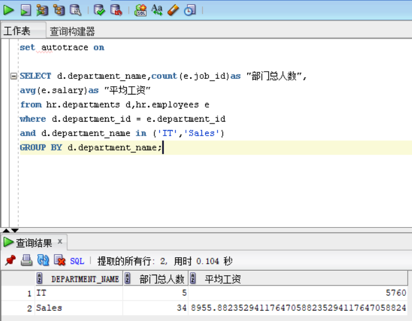

# 第一次实验
## 文浩 18级 软件工程2班 201810414220

## <li>查询1
    set autotrace on
    SELECT d.department_name,count(e.job_id)as "部门总人数",
    avg(e.salary)as "平均工资"
    from hr.departments d,hr.employees e
    where d.department_id = e.department_id
    and d.department_name in ('IT','Sales')
    GROUP BY d.department_name;
### <li>查询结果

### <li>执行计划

### <li>优化指导

## <li>查询2
    set autotrace on
    SELECT d.department_name,count(e.job_id)as "部门总人数",
    avg(e.salary)as "平均工资"
    FROM hr.departments d,hr.employees e
    WHERE d.department_id = e.department_id
    GROUP BY d.department_name
    HAVING d.department_name in ('IT','Sales');
### <li>查询结果

### <li>执行计划

## <li>代码分析
比较两个SQL语句，发现查询语句1相对于查询语句2来说，语句1的效率要比语句2的效率高一些：因为语句1是先进行条件的判断，然后进行筛选，最后得出结果；而语句2则进行了两次筛选，浪费资源。

## <li>代码优化
    set autotrace on
    SELECT c.department_name,count(e.job_id)as "部门总人数",
    avg(e.salary)as "平均工资"
    from (SELECT department_name,department_id
        from hr.departments
        WHERE department_name in('IT','Sales'))c ,hr.employees e
    WHERE c.department_id = e.department_id 
    GROUP BY c.department_name
### <li>查询结果

## <li>优化代码分析
我通过先根据条件查询hr.departments表，筛选出结果并形成一个新的表c，然后通过c表和hr.employees表进行判断来筛选出最后的结果；这种做法使用了嵌套查询，提高了查询的效率。